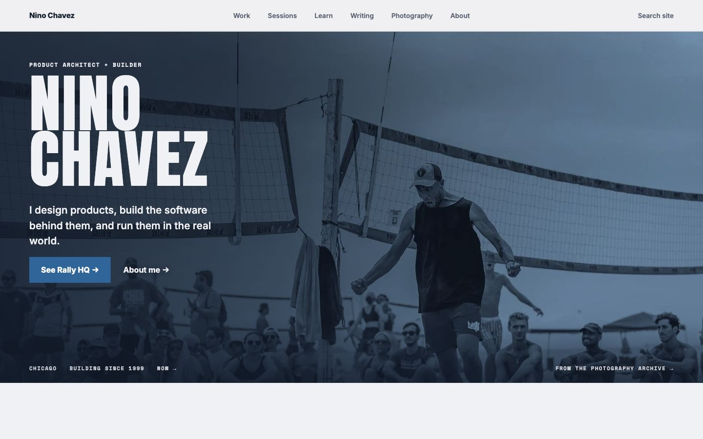
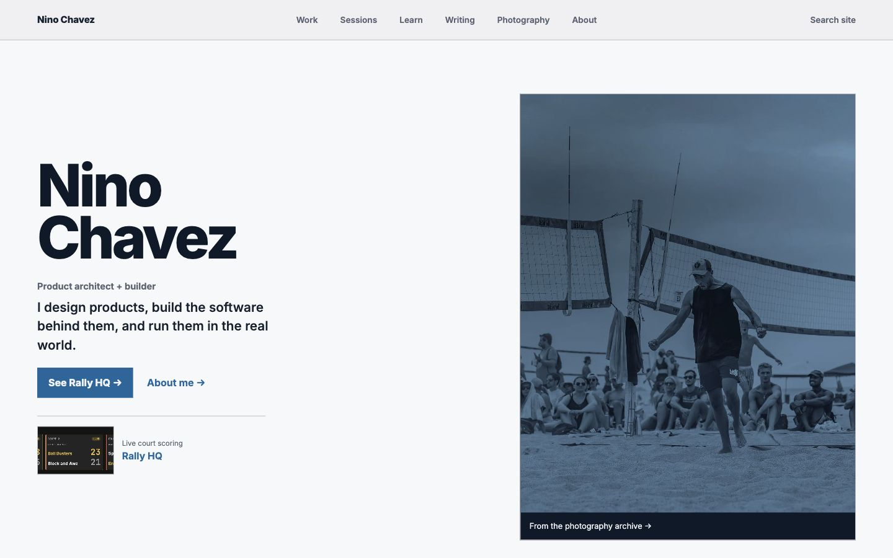

# Rebuild the hierarchy and recover the site's visual conviction

September 30, 2026. Read-only audit of the local redesign and its governing assumptions. No product code, routing, publishing configuration or production data changed during this audit.

The refit is not ready to continue as a styling rollout. The homepage lost a defining visual composition, while the wider site still asks people to interpret overlapping sections and repeated navigation. A full redesign is justified as a candidate. Following Nino's clarification of the site's purpose, recommend Writing, Building, Photography and About, supported by one public frontend application. The visual direction and framework choice still need separate proof.

Use the [evaluation model](EVALUATION-MODEL.md) as the starting point. It defines arrival jobs, content relationships, three competing navigation structures, page hierarchies, removal tests and acceptance criteria. It replaces “make every page look like B” as the basis for further design work. It does not retroactively approve a new visual direction.

## Cohesion exists in the shell; the experience needs a stronger organizing idea

| Question | Verdict | Why |
|---|---|---|
| Is it cohesive? | Partly | Common naming and navigation connect the properties. Repeated headers, competing search scopes and two gallery footers expose their separate implementations. Matching colors do not resolve those differences. |
| Is it sensible? | Within individual collections, more than across the whole | Albums and articles have recognizable jobs. Work, Sessions and Learn require the visitor to understand the owner's classification before choosing. |
| Is it delightful? | Uneven | The real photography supplies energy and authorship. The current homepage isolates it into a conventional rectangle and spends the recovered space on disconnected text and repeated proof. |
| Does everything earn its place? | No | Duplicate footer identities, repeated Rally HQ entry points, stacked navigation and several introductions before useful items all need a removal or relocation decision. |

These are design judgments based on rendered frames and observed structure, not measured audience outcomes.

## The homepage changed the role of the photograph

The earlier opening made name, claim and court image one composition. The current opening makes them separate objects. The image changes from an environment to an illustration beside a pitch. The wide crop's atmosphere becomes a narrower, heavily treated frame; a broad gap separates it from the copy. The small Rally HQ card repeats the adjacent action without supplying much additional explanation.

This is more than moving things around. The refit's CSS explicitly replaces the photo-backed hero with a light grid, turns off the prior background layer, changes the display treatment, and gives the photograph a 4:5 crop. See [the owning styles](../../../app/by-nino-frontdoors.css) and [homepage](../../../app/page.tsx).

| Earlier composition | Rejected local refit |
|---|---|
|  |  |

The earlier version wins this comparison on image presence and singularity. The newer version gives text an uncomplicated background. That legibility benefit does not require sacrificing the image's scale. Future concepts can change the typography, image choice or composition completely; they must beat the earlier frame on the same actual screen, not merely preserve the photo asset somewhere.

The first visual reviewer initially called the new version “more refined.” After a direct challenge, they withdrew that judgment and their initial proposal to add more explanatory cards. This disagreement matters: a polished description of an orderly layout is not evidence that the layout is better.

## The navigation should distinguish thinking, building and photography

Nino describes writing as his AI-assisted thinking, photography as his photographic skill, and projects/demos as evidence of what he builds and how. That purpose supports the following model. It supersedes this audit's earlier proposal to keep Projects and Learn as separate global entries.

```text
Nino Chavez / Home — identity, atmosphere and selected proof
├─ Writing — Signal Dispatch, articles, series, topics and archive
├─ Building
│  ├─ Products I run — useful apps/services and direct actions
│  ├─ Tools and experiments — useful work with honest availability
│  ├─ Studies and methods — applied analysis and reusable technical work
│  ├─ How it was built — sessions, demonstrations and decisions
│  └─ Guides — useful outputs, ordered stages and checkpoints
├─ Photography — events, albums, photographs, date, collections, saved
└─ About — biography, now, CV and contact

Inside an article or gallery:
small common identity + useful local navigation + the chosen object
Utility: clearly scoped search, privacy and analytics preferences
```

This combines candidate A's clear public map with candidate C's local focus. It takes relationship-based discovery from candidate B through relevant links and search, rather than flattening every object into one feed. Building covers both the result and the making. The existing material includes applications, tools, documentation and methods; a narrower Projects label does not explain that breadth. First-click testing must check whether visitors predict that practical guides live here.

Keep existing public URLs unless a separately checked migration earns a change. Changing where Sessions appears in navigation does not require deleting `/demos`, rewriting links or losing the original sessions. Tutorials can belong to the publication as authored objects and also appear in a learning path without creating a second canonical copy.

### Why not simply choose the smallest menu?

The model challenger correctly rejected burying teaching under Work without evidence. The follow-up source review found real stages, outputs and checkpoints in the existing Learn paths. Keep them as visible guides within Building and surface them from relevant articles/projects and search. Four links are a consequence of the clarified purpose, not an arbitrary limit. If visitors cannot find the guides, the grouping or label must change.

The Builder path already groups Rally HQ with “The Browser Is a Shell Command” and “The Scaffolding the Agent Doesn't Build.” This is a useful relationship among artifact, technique and argument. Co-curation does not prove a literal build history. Preserve truthful roles and provenance; do not label all historical work AI-built. Writing remains the canonical home of an article even when another collection points to it.

The one-library alternative remains viable for cross-topic discovery. It is weaker as a default browse experience if the photo corpus overwhelms projects and writing. The independent-properties alternative is strongest for direct article/album arrivals, but must still make the author and wider body of work easy to recognize. These are hypotheses; no participant test has selected the winner.

## Apps belongs in scope and exposes another disconnected destination

The initial audit omitted `apps.ninochavez.co`. After Nino identified the omission, the parent opened the live catalog, Cutting Board page and Yawn page, and an independent reviewer inspected the catalog, router and portfolio sources. These product pages help someone understand a tool, obtain a build and read installation/release information. They earn their place in the site.

Observed September 30:

- The [catalog](https://apps.ninochavez.co/) lists Cutting Board and Yawn. Its navigation points separately to Main site and Demos. It declares `noindex, nofollow` and calls its pages unlisted rather than confidential.
- [Cutting Board](https://apps.ninochavez.co/cutting-board/) presents public-alpha downloads for macOS and Windows. The catalog's main action mentions macOS only. Downloaded artifacts and platform operation were not tested in this visit.
- [Yawn](https://apps.ninochavez.co/yawn/) presents an internal-alpha installer, platform requirements and release notes. It declares `noindex`. Its catalog card has a source-owned JSON refresh path.
- The current portfolio records Film Room as building, with no destination, and has no named Cutting Board or Yawn records. This demonstrates disconnected presentation; the exact historical product-name relationship needs reconciliation with the app owner before rewriting records.

Make Apps a clearly visible collection within Building. Give an app one coherent product identity with purpose, honest availability and a direct action. Link its making and related writing without requiring people to read those before installing. A separate global Apps link is not justified solely by its existing hostname; test whether Building makes the destination predictable.

Include the catalog and product marketing/download pages in the one-public-frontend target. Keep native applications and their release processes independent. The release process must remain the authority for version, platform, checksum and download links. One shared frontend can serve multiple hostnames during migration, so retaining `apps.ninochavez.co` does not require a second UI implementation.

The local router maps `/cutting-board/*` to `private-beta-kit.film-room-portal.pages.dev` and `/yawn/*` to `yawn-site.pages.dev`, with prefix rewriting. Preserve these public paths and their nested assets/links until tested replacements exist. The router's deployed version was not queried. No redirect, indexing or publication change was made. The unlisted policies mean public discovery is a separate product decision, not an automatic consequence of consolidation.

Source anchors: `/Users/nino/Workspace/dev/sites/nino/apps-ninochavez/index.html`; `/Users/nino/Workspace/dev/platform/apps-ninochavez-router/src/index.js`; current `app/data.ts` and `app/links/page.tsx`. The live pages establish displayed content and actions; they do not verify the binaries' functionality or release claims.

## Operating products changes what Building must prove

Nino added The Rotation and Minder: Your Day to the scope. This makes an operator's body of work part of the site's purpose. Building should lead with products people can use and then expose the decisions, demonstrations and writing behind them. Calling all of this experiments, demos or AI output would understate the responsibility of maintaining products for users.

The parent opened [The Rotation](https://therotation.tv/) and observed its volleyball-specific navigation, schedule/results/saved/rankings controls and a separate Apple TV promotion marked in development. The public [Minder App Store listing](https://apps.apple.com/us/app/minder-your-day/id6803974428) identifies Minder: Your Day and links to [mindyourday.app](https://mindyourday.app/), which has product information, demonstrations, walkthroughs, privacy and support. Those observations establish public destinations and displayed availability; no product behavior, data freshness, installed build or adoption was tested. Current portfolio `app/data.ts` and `app/links/page.tsx` contain no named Rotation or Minder entries.

| Surface | Place in the personal site | What remains product-owned |
|---|---|---|
| The Rotation | Prominent product record with its purpose, Nino's role, an Open The Rotation action and sourced making/writing links | `therotation.tv`, its match-discovery navigation, saved state, data operation and release process |
| Minder: Your Day | Prominent product record with real app evidence, App Store action and links to the product site and relevant making/writing | Native app, App Store release, `mindyourday.app` guides/support/privacy and product-specific navigation |
| Cutting Board and Yawn | App catalog and product pages in the shared personal-site frontend target, preserving their individual availability | Native code, releases, artifacts, truthful requirements and authoritative download metadata |

This refines the single-stack recommendation: consolidate the personal publishing/discovery experience; evaluate additional product-site sharing only where it removes a demonstrated maintenance burden. It does not justify replacing independent product domains or operational interfaces with the portfolio menu. One product record should connect identities and destinations. It must not be a second manually maintained release database.

The next concept comparison must show a visitor finding and opening a real operated product, alongside the article and photo referrals. The homepage should acknowledge the breadth of the work through selected real material without becoming a catalog or losing its photographic identity. Product names, medium, role and availability remain separate fields; website visits and store-link clicks are not evidence of product use or installations.

## Work Library contributes both a tool and public intellectual work

The public side of Work Library belongs in this evaluation. Its project is a tool for publishing working material and delivering private handoffs. Its published material is a separate body of arguments, studies and methods. Neither is currently represented by a Work Library entry or destination in the personal site's `app/data.ts` or Links page.

The parent opened [the public entrance](https://library.ninochavez.co/) and [One Cart Across Two Storefronts](https://library.ninochavez.co/commerce/bc-shared-cart-pattern) in an isolated browser context with no signed-in session. Both opened without entering an access phrase. This confirms these two public encounters only; it does not verify protection of every private route or asset. The case contains a substantive technical analysis, presented as draft/active work rather than delivery evidence. Its technical claims were not re-audited here.

The rendered entrance says “Open private work. Or browse what’s public.” Its next explanation addresses an access phrase. This makes a cold public reader interpret the private delivery system before reaching public material. On the inspected case, source version, receipt access, draft state and an authorization notice precede the argument. Keep essential status and limits legible, but make the reader's question and answer the primary hierarchy. This is an observed public-reading issue, not a request to remove source integrity.

The local `docs/PRODUCT.md` already distinguishes public publications, private handoffs and an owner archive. It explicitly says the contract is the accepted next direction and has not shipped in full. Do not describe the target as the current live experience. The registry includes native publication presentation alongside legacy case surfaces; this audit's captured case is one legacy encounter.

Recommended placement:

- **Work Library, the tool:** one Building record explaining what it does and linking to inspect its public output. Do not imply public signup, self-service hosting or source availability that has not been verified.
- **Public publications:** surface them under Writing when the reader comes for an argument/research piece, and under Building's studies/methods or the relevant project when the reader comes to apply or inspect technical work. Use related links and one canonical publication; do not reproduce each document into both sections.
- **Private handoffs and owner archive:** retain their separate reader jobs and access paths. They do not become public navigation categories or feed records.

The independent reviewer favored leaving the whole delivery UI separate. The parent's narrower conclusion preserves private delivery/source authority but leaves public catalog and reader integration open. Work Library already uses React/VineNext, so a framework mismatch is not a sufficient reason to retain another public shell. Its publication contracts, permissions and rendering behavior still require explicit migration tests.

The generated public map is read by both the Worker and server layout; source code includes exact-case checks and private route/asset handling. This is evidence of implementation, not a security test. Any shared public frontend/search must receive only admitted public content and public-safe metadata/assets. Work Library remains authoritative for source pins, claims, publication admission, lifecycle and private access. A unified public experience must not turn drafts into completed work or published studies into proof of a client outcome.

Source anchors: `/Users/nino/Workspace/dev/apps/work-library/docs/PRODUCT.md`, `sources.yml`, `worker/index.ts`, `app/[collection]/[caseId]/layout.tsx`, `app/lib/content.ts`, `app/page.tsx`, `package.json` and `wrangler.jsonc`. The current local source is not assumed to match the deployed revision. Only the two anonymous pages named above were inspected live.

## Specific elements that need to justify themselves

| Surface / element | Current judgment | Consequence and design response |
|---|---|---|
| Homepage contained hero photo | Replace the current composition | It loses the scale and name/image relationship that made the earlier opening distinctive. Test an immersive composition, a photo-led sequence and an artifact-led composition with equal real content. |
| Homepage Rally HQ button plus tiny card | Combine or give different jobs | Both lead to the same project. One can be a convincing proof/action; two nearby invitations add little. Do not remove all concrete product evidence. |
| Work's six-domain opening | Demote taxonomy or earn it with a clear browse task | It foregrounds classification before named work. Lead a cold evaluator toward real examples; keep the complete archive reachable. |
| Sessions' introduction, two explanatory panels and collection introduction | Combine repeated orientation | The page repeatedly explains how to choose before presenting the full collection. Move useful distinctions into the actual items or retrieval controls. |
| Learn's “Choose by output” followed by “Explorer” | Replace the mismatch in hierarchy | The visible first option names an identity; its output is subordinate and abstract. Make the concrete result the selection label, subject to source-truth review. |
| Publication global header plus publication header | Reduce competition between levels | Keep authorship, local reading controls, series and RSS. Test a compact shared identity layer instead of two equally assertive site entrances. |
| Main Writing entrance and Astro publication entrance | Give the public route one visual owner | Both exist locally, but the router determines which visitors receive. Do not maintain two competing public home experiences by accident. |
| Gallery shared footer plus legacy gallery footer | Consolidate | Duplicate name, contact and privacy destinations increase noise without supplying a new decision. One footer can preserve the useful destinations. |
| Gallery local navigation and mobile dock | Retain the useful jobs; evaluate their arrangement | Events, date, collections and saved photos are different retrieval paths. Fewer visible controls is not inherently better. |
| Album Popular rail before full grid | Test ordering by arrival task | It restores discovery, but popularity may not help someone find a particular player or moment. Compare with direct collection access; do not silently remove it again. |
| Album title and photo count repeated above retrieval | Combine if recognition remains clear | Date/event identity earns space. A second ceremonial section introduction may not. |
| Desktop portrait viewer's bright gray side stage | Refit or redesign | The surround competes with the narrow photo. Preserve uncropped image integrity while making the canvas recede; do not fill the area by cropping the photograph. |
| About, coverage, search, privacy, error and utility pages | Keep their jobs; avoid a universal hero | Biography, commissioning, retrieval and completion need different hierarchy. Reuse dependable controls, not a single composition. |

The current timeline was checked live: it has the restored continuous year rail. Older same-day captures still show the rejected boxed year buttons. They are regression history, not a current defect. The latest album also has the restored Popular rail. Still frames do not prove scrolling, state restoration or download behavior; those need their own interaction checks.

## Apply Gestalt to relationships, not decoration

The homepage currently fragments one story into a copy block, action row, mini proof card and isolated photograph. Proximity and common region explain that separation. The previous photograph created one strong perceptual field. This does not prove that all elements should be placed on an image; it explains why the change altered the whole impression.

Similar typography and rules help establish a family across the site. Similar-sized introductions and taxonomies can also make unlike jobs look equally important. Use similarity for comparable actions, and contrast for different levels of importance. On photography pages, the light global header can become a stronger figure than the image workspace underneath it. A quieter identity layer deserves comparison.

Cohesion should mean recognizable authorship, predictable navigation and dependable controls. It need not mean identical backgrounds, identical headers, or identical content templates. These are applications of [proximity](https://www.nngroup.com/articles/gestalt-proximity/) and [similarity](https://www.nngroup.com/articles/gestalt-similarity/), informed by the reviewed frames.

## Mobbin and Impeccable have not supplied a design verdict

The saved Mobbin evidence contains a public portfolio-category page with Fiasco, Metalab and other preview tiles. Its second record is viewport metadata for that same page. It does not establish a reviewed search, reading, gallery or Back flow. Those previews can suggest visual directions; they cannot validate this information architecture.

No callable Mobbin connector is exposed in this session's tool catalog. Mobbin's current official page describes screen/flow access through its [MCP service](https://mobbin.com/mcp), with plan requirements. I checked that capability description; I did not claim authenticated flow access or add an integration.

Next reference work should answer bounded questions: how a reading experience keeps its author's identity without a competing global header; how an event gallery supports find/view/save/return; how an image-led personal site exposes real project evidence. Each reference needs a URL, screen/state, observed behavior, what transfers and what does not. Borrow an interaction principle; do not import an agency's palette or infer effectiveness from popularity.

The Impeccable context loader ran. It loaded a root `DESIGN.md` that labels itself historical and points elsewhere, and found no matching surface brief. That is a real context-routing weakness even though the human-readable pointer exists. The old canonical design document is useful history under the newly authorized rethink, not a veto on replacement.

An isolated assessment ran the detector against five main route components: home, Work, Sessions, Learn and Writing. It returned zero findings. That says nothing about the wide empty space, boxed photograph, weak recall or navigation overlap. The scan did not exercise every property or prove that its rules can detect this class of failure. No browser overlay was injected because the available browser evaluation interface is read-only. A zero count was not used as an acceptance gate.

## Architecture: one public experience needs one accountable owner

The source architecture has three public renderers behind a fourth project's router:

```text
ninochavez.co → router Worker
├─ React / VineNext: home, projects, sessions, learning, /blog, /photography, coverage
├─ Astro: /blog/*, authored formats, feeds, search assets and content outputs
└─ SvelteKit: /photography/*, gallery data, viewer, saved state, auth and APIs

nc-demos supplies content to the main app; it is not a fourth public renderer here.
```

I checked the router's actual `resolveDestination` source. The bare `/blog` and `/photography` entrances belong to the main app; deeper routes go to the specialist apps. The deploy running in production was not queried in this audit. Separate local previews consequently do not reproduce the composed website. A shared-origin local preview using the real route rules belongs in any next design validation, regardless of repository choice.

| Option | Strongest benefit | Main cost / limitation | Judgment |
|---|---|---|---|
| Separate repos/apps, shared route and design contracts | Smallest change; retains specialist publishing and gallery behavior | Three implementations can still drift; coordination depends on versioning and tests | Viable, but it must improve on the current copied-shell arrangement |
| One monorepo, separate apps initially | One change can coordinate navigation, route ownership, tokens, content schemas and composed preview | Does not itself create shared UI behavior or eliminate framework adapters | Useful transitional organization, insufficient as the final consolidation |
| One public application and shared stack | One actual shell, route map, metadata and consent implementation; simplest whole-site preview and navigation ownership | Replatforms publication rendering and gallery behavior; broadens release coupling and regression risk | Recommended target; prove the framework with representative behavior before migration |

The architecture reviewer preferred contracts first. I agree a framework rewrite is not a prerequisite for recovering the homepage, but do not accept “the router works” as sufficient defense of the current organization. Repeated shell changes across three runtimes and misleading isolated previews are concrete reasons to test stronger consolidation.

**Updated technical recommendation:** commit to one public frontend for the personal site, writing, photography and integrated app catalog/product pages, with one IA, navigation/component system, metadata policy, search model and consent behavior. Migrate in verified slices. Moving those three frontends into a monorepo alone would leave the repeated implementations that caused drift. The architecture reviewer's follow-up agrees with this target after considering the clarified content purpose. Independently operated products such as The Rotation, Minder and Rally HQ are represented and linked here; their operational interfaces are outside this migration. This is a recommendation; it does not claim that a framework or migration has been approved.

Choose the framework using two demanding slices: a real rich article with its authoring, code/visual blocks, series, feeds and search; and an album with server-backed pagination, keyboard viewing, local saves, real downloads and a private-share variant whose capability cannot leak into canonical/OG output. Include a cross-property journey. A metadata-only landing page cannot establish migration feasibility.

Then consolidate the shared shell, publication, public gallery discovery and sensitive gallery flows. Keep specialist services where useful: publication authoring, ingestion/enrichment, media delivery, Supabase/access enforcement and streamed ZIP downloads. Products featured in the portfolio, such as Rally HQ, are outside this consolidation. Shared implementation must support distinct reading and gallery experiences, not force identical page templates.

For that trial, compare duplicated code removed, clarity of ownership, preview/deploy coordination, delivery performance and preserved behavior. Include MDX formats, series, feeds and Pagefind; Supabase public/unlisted/admin boundaries; saved-photo storage; viewer navigation; JPEG and ZIP delivery; canonical/OG/sitemap output; consent and analytics exclusions. Authenticated or private paths require controlled test evidence. Do not copy production secrets into the client or treat a visual mock as migration proof.

A single codebase has no inherent SEO bonus. Relevant content, crawlable routes, useful internal links and correct canonical/redirect behavior matter. Google's [ranking-system description](https://developers.google.com/search/docs/appearance/ranking-systems-guide) distinguishes page-level and site-wide signals. Preserve existing URLs where possible; if moving them, follow an explicit [URL migration](https://developers.google.com/search/docs/crawling-indexing/site-move-with-url-changes).

## Analytics supports the test priorities, not a visual winner

The raw saved reach report covers August 30–September 28, 2026. It records 550 sampled page loads, including 310 mobile and 240 desktop loads, and 60 entry visits. These are browser measurements, not people; owner and agent activity can be included. The saved action report, retrieved September 30 at 03:23 UTC, has no matching action history for its selected completed-day window after the new collection release.

Those historical observations justify testing mobile and direct referrals. They cannot prove that users prefer the new hero, that Learn should leave navigation, or that a framework migration will increase engagement. Nino's report that he shares writing through LinkedIn remains a valid distribution fact even where the saved report has sparse or missing writing arrivals. This audit did not refresh the analytics API or infer demographics.

Measure the appropriate outcome per journey. Watch whether people can find and recover a photograph, continue the intended reading, understand a project and predict a navigation destination. Treat scroll depth, time and clicks as proxies. At this traffic level, moderated task walks are a more immediate design input than claiming a statistically decisive visual A/B result.

## The red team has distinct responsibilities and must challenge itself

| Reviewer | Responsibility | Completed evidence |
|---|---|---|
| `architecture_inventory` | Actual public route/nav/content inventory, then independent challenge to the proposed model and detector evidence | Sources in all three apps; six arrival cases; challenged teaching under Work; zero-finding detector result and Mobbin limitations |
| `cold_visual_review` | Unanchored composition, hierarchy, character and Gestalt assessment before seeing detector results | Desktop/phone captures across properties; initial local home render; baseline comparison; correction after adversarial rebuttal |
| `architecture_red_team` | Strong cases for and against shared contracts, monorepo and one application | Router, app manifests, content pipelines, gallery state/access/delivery boundaries |
| Parent | Visitor-first model, direct visual inspection, source verification and final judgment | User screenshot; baseline/current home; Work, Sessions, Learn, publication and photo frames; live current timeline; route/footer/style source; raw saved analytics and Mobbin records |

These were bounded native read-only subagents. No persistent sidebar tasks, write workers or additional dev servers were created. No claim is made that Operator's separate CLI routing receipts were produced for this native path. The design review finished before the detector assessment entered synthesis. The parent challenged positive aesthetic language, corrected stale screenshots, retained the teaching-discovery objection, and rejected the suggestion that a single library inherently forces deep referrals through an index.

The visual reviewer's heuristic number is deliberately not promoted to a site score: several behaviors were not observed, and the initial language score conflicted with its own navigation findings. Report the concrete defects and strengths instead of laundering them through a total.

## Next gate: compare experiences before changing the site again

1. Test the navigation candidates with the same arrival tasks, including an app download referral and a public Work Library study. Use real titles, projects and events. Ask where someone would go first and what they expect there; do not teach them the taxonomy first.
2. Develop three divergent whole-screen concepts across the same home, article, album and project states. One must explore full-bleed photographic identity; the others must offer equally specific alternatives, not smaller variations of the rejected split hero.
3. Compare first view, full-page sequence, phone/desktop and one real continuation per concept. Judge emotional force and clarity independently. A concept must preserve task completion and beat the earlier homepage's visual conviction.
4. Fold useful ideas from rejected concepts into the chosen one explicitly. Then run the technical consolidation trial against that experience, not against an abstract component inventory.

Questions skipped for this audit: the user supplied the referral context, rejected the current visual treatment, explicitly opened the scope to a full design/architecture rethink, and clarified how writing and building relate. The recommendation now favors one public application. Label validation, final art-direction selection, framework proof and migration approval remain future decision points; this audit does not pretend they are already settled.

## Provenance and limits

Current source owners inspected: the three active refit worktrees and `/Users/nino/Workspace/dev/platform/ninochavez-router`. Representative frames cover the main home, Work, Sessions, Learn, Writing, About, publication home/article and photography landing/album/timeline/photo. This is coverage of page families, not every article, photo, utility state or authenticated journey. Older and newer frames were distinguished; live local home and restored timeline structure were checked in-session.

The September 30 follow-up rechecked all three application manifests, the Learn content/template and representative project/session/article relationships. Two existing read-only reviewers separately challenged the new grouping and consolidation recommendation. No additional analytics or visitor tests were run; the owner's clarified intent and verified content structure changed the recommendation.

Evidence anchors: [current source capture set](../2026-09-29-frontend-implementation/evidence/site-wide-20260930/), [newer album frame](../2026-09-29-frontend-implementation/evidence/site-wide-20260930/regression-rerun/album-phone-final.jpg), [newer timeline frame](../2026-09-29-frontend-implementation/evidence/site-wide-20260930/regression-rerun/timeline-month-verified.jpg), [Mobbin saved listing](../2026-09-29-critical-frontend/evidence/mobbin-portfolio.json), [saved reach report](../2026-09-29-critical-frontend/evidence/site-analytics-30d.json), [saved action report](../2026-09-29-critical-frontend/evidence/audience-live-actions.json), and the [navigation contract](../../IA-NAVIGATION.md). Source references establish implementation; frames establish appearance; neither establishes audience preference.

External sources linked above were fetched during this audit. Current production routing, fresh audience analytics, authenticated Mobbin flows, physical-device behavior and migration performance remain unverified. Temporary audit browser state was reset and the parent's audit tab was closed. Existing user-requested local preview servers were retained.
